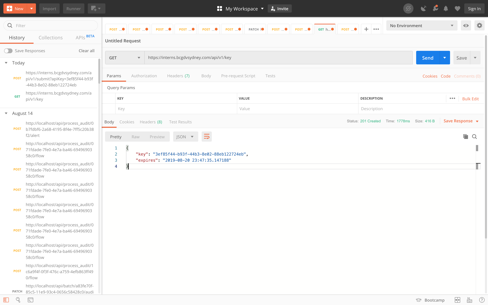

# BCGDV Intern Submission

Initially, I did this submission using Postman

1. Submitted a GET request and was returned the key in a json object with HTTP Status: 201 Created

2. Submitted a POST request with a json object in the body containing my name and email. Received a HTTP Status: 202 Accepted
