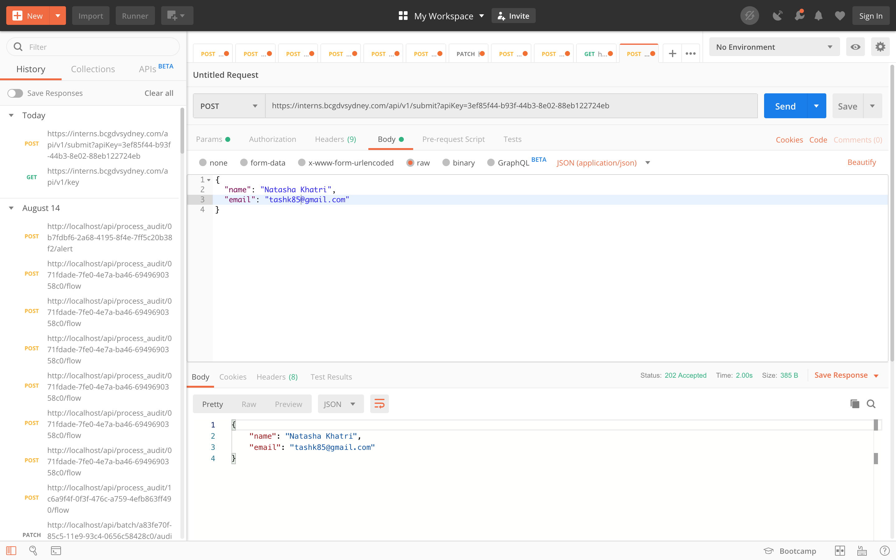

# BCGDV Intern Submission

Initially, I did this submission using Postman

1. Submitted a GET request to the URL https://interns.bcgdvsydney.com/apiv1/key and was returned the key in a json object with HTTP Status: 201 Created

2. Submitted a POST request to the URL https://interns.bcgdvsydney.com/apiv1/submit?apiKey=<API_KEY>, where <API_KEY> was replaced with the "key" received from api request in step 1. In the same request, I also included a json object in the body containing my name and email. Once sent, received a HTTP Status: 202 Accepted and the same json details shown in response body.

